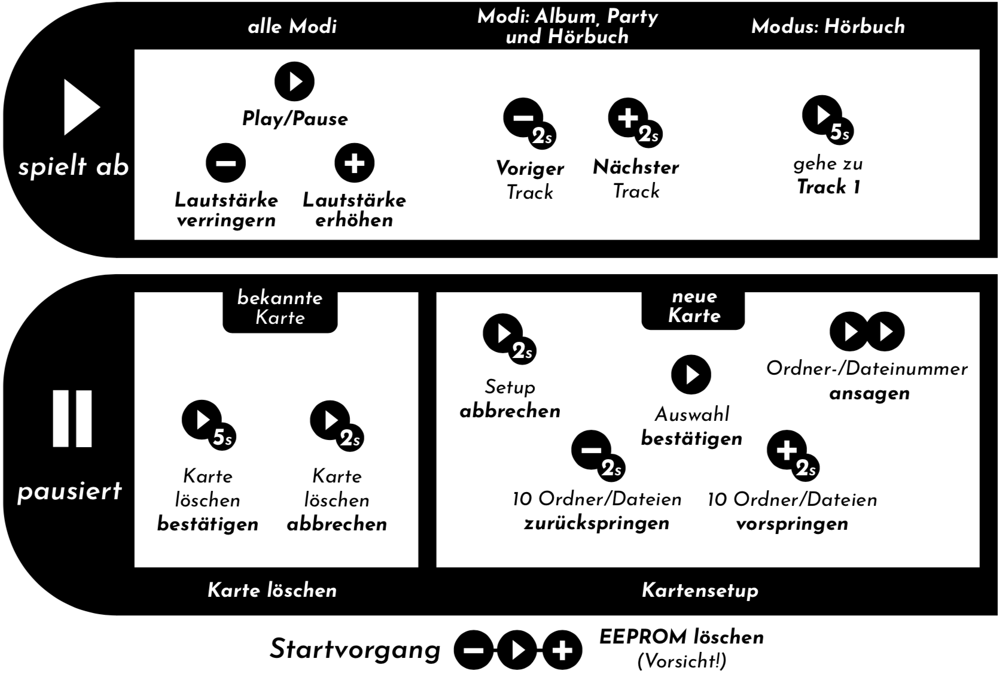

Alternative TonUINO Firmware
============================

Dies ist meine alternative Firmware für das wundervolle [TonUINO](https://www.voss.earth/tonuino/) Projekt. Ziel ist hier nicht unbedingt 100%ige Funktionsgleichheit mit der original Firmware. Es wurden vielmehr für meinen Zweck interessante Funktionen hinzugefügt und desweiteren auch einige Punkte (erstmal) ausgelassen. Im großen und ganzen macht es einfach Spaß, sich mit der TonUINO Plattform auszutoben, ich bin deswegen auch viel in der [TonUINO Community](https://discourse.voss.earth/) aktiv. Schaut doch dort auch einfach mal vorbei - ihr findet dort viele Gleichgesinnte, Bauvorschläge, Hacks und Informationen rund um den TonUINO.

Die Firmware wird "as-is" zur Verfügung gestellt. Wenn jemand die Firmware in seinem TonUINO einsetzt, freue ich mich natürlich darüber. Ich kann allerdings keinen Support bieten.

## Funktionsübersicht

- Abspielmodi: Hörspiel, Album, Party, Lieblingsfolge und Hörbuch.
- Speichert die Ordnerverknüpfungen, Abspielmodi etc. auf den NFC Tags/Karten.
- Unterstützung für MIFARE Classic (Mini, 1k & 4K) Tags/Karten.
- Unterstützung für MIFARE Ultralight / Ultralight C Tags/Karten.
- Unterstützung für NTAG213/215/216 Tags/Karten.
- Debugausgabe auf der seriellen Konsole.
- Maximale Lautstärke kann eingestellt werden.
- Konfigurationsdialoge (NFC Tags/Karten anlernen/löschen etc.) können abgebrochen werden.
- NFC Tags/Karten können komplett wieder gelöscht werden.
- Nächster/Vorheriger Titel in den Abspielmodi Album, Party und Hörbuch.
- Timer zum automatischen abschalten.
- Optional: Fernbedienbar über Infrarotfernbedienung (inkl. Tastensperre).
- Optional: Unterstützung einer Status LED.
- Optional: Unterspannungsabschaltung für z.B. die [CubieKid Platine](https://www.thingiverse.com/thing:3148200).

## Tastenbelegung

## Audio Meldungen

TonUINO funktioniert nur korrekt, wenn ein zur Firmware passendes Set and Audio Meldungen auf der SD Karte vorhanden ist (die Ordner **mp3** und **advert**). Unter MacOS X lässt sich das passende Set an Audio Meldungen mit dem beigelegten Script `create_audio_messages.sh` schnell und einfach erzeugen. Benötigt werden dazu die Tools `say` und `ffmpeg`. Zum Download kann ich die Dateien leider nicht anbieten!

## Lizenz

GPL v3. Siehe [LICENSE](../LICENSE.md).
