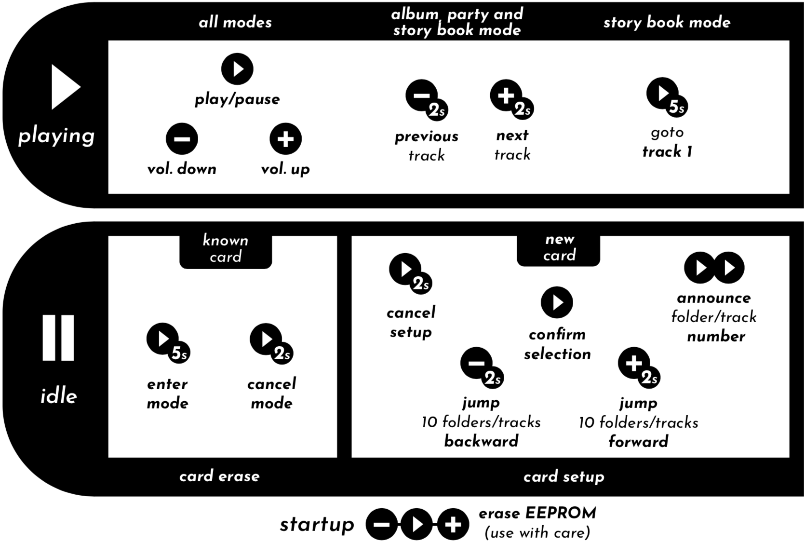

Alternative TonUINO Firmware
============================

This is my alternative firmware for the wonderful [TonUINO](https://www.voss.earth/tonuino/) project. The goal of this firmware is not to implement 100% the same features as the original firmware. I more or less just added what fits my use case and i also removed (for now?) some stuff i currently don't really need. Overall it's just fun to play around with TonUINO, which is also the reason why i am very active in the [TonUINO Community](https://discourse.voss.earth/). Make sure you drop by, there is lots of stuff to discover.

**The firmware is provided "as-is". I'm happy if all this is useful for anyone else, but can't offer support.**

## Features

- Playback modes: Story, album, party, single, story book.
- Saves playback modes etc. directly to the NFC tags/cards.
- Next/previous track in album, party and story mode.
- Supports MIFARE Classic (Mini, 1K & 4K) tags/cards.
- Supports MIFARE Ultralight / Ultralight C tags/cards.
- Supports NTAG213/215/216 tags/cards.
- Debug output to the serial console.
- Preferences are stored in EEPROM.
- Setup dialogues (setup/erase NFC tags/cards, parents menu etc.) can be aborted.
- NFC tags/cards can be erased.
- Parents menu to erase NFC tags/cards and to change preferences like startup volume, maximum volume, menu volume, equalizer and shutdown timer (requires an external circuit or compatible power bank). You can also manually trigger the shutdown there and reset the story book progress and preferences.
- Optional: PIN to protect parental functions.
- Optional: 5 Buttons.
- Optional: IR remote control (incl. box lock). The remote (which needs at least 7 keys) can be learned in using the parents menu.
- Optional: Status LED.
- Optional: Low voltage shutdown i.e. for the [CubieKid PCB](https://www.thingiverse.com/thing:3148200).

## Button Cheat Sheet



## PIN Code

The (optional) PIN Code to secure the parental functions is by default

- `play/pause, vol-, vol+, play/pause`

and can be changed in the sketch before compile time.

## SD Card Folder Structure

The folders on the SD card, that will hold your mp3 files, need to be named **01 bis 99** - that is **two digits**. The mp3 files in these folders need to start with a **three digit zero padded number** like **001 to 255**, but may [1] contain more characters afterwards. Allowed would be `001.mp3` or `001MyTune.mp3`.

It has been proven benefitial to prepare the whole folder structure on the computer and then copy everything to the SD card in one go. That way it's made sure the order of the files is correct.

[1] Not all derivates of the DFPlayer Mini module accept characters after the three digit number. In this case only `001.mp3`, `002.mp3` etc. would be allowed.

## Audio Messages

TonUINO only functions correctly, when there is the correct (**as in matches the firmware**) set of audio messages on the SD card. These are the folders **advert** and **mp3**.

### Download the audio messages

You can download the audio messages, generated with Amazon Polly, in several different languages:

- German: [audio-messages-polly-de.zip](https://seisfeld.github.io/tonuino/audio-messages-polly-de.zip)
- English: [audio-messages-polly-en.zip](https://seisfeld.github.io/tonuino/audio-messages-polly-en.zip)

Extract the `.zip` file and copy the folders **advert** and **mp3** to the SD Card. Done.

### Create the audio messages yourself

If you want to, you can as well create the matching set of audio messages yourself, using the `create_audio_messages.py` python script from this repo. This way then also offers different text-to-speech engines if you like (see below). The script can create **english** and **german** audio messages. It is tested on macOS, but you should be able to run it on Windows / Linux with minimal effort - given you resolve the dependencies (like [Python](https://www.python.org/downloads/)).

The script is able utilize three text-to-speech engines:

- Locally - on macOS only - using the tools `say` and `ffmpeg`. If you have a Mac this method is fast, simple and free of charge. 
- Over the internet using Amazon Polly, the text-to-speech service of Amazon.
- Over the internet using Googles Cloud text-to-speech service.

The amount of messages you need to create, is covered by the free tiers of the respective services - Amazon ([pricing](https://aws.amazon.com/de/polly/pricing/)) or Google ([pricing](https://cloud.google.com/text-to-speech/pricing)). You need to create an account for both and once the free tier is used up, the costs are just a few cents.

#### Create audio messages using `say` and `ffmpeg`

In addition to `say` (part of macOS) you also need `ffmpeg`.

1. Install `ffmpeg`, i.e. via [Homebrew](https://brew.sh): `brew install ffmpeg`
2. Change into the folder where you unzipped the `.zip` from GitHub or where you cloned the repo to.
3. Run `tools/python create_audio_messages.py --use-say --lang=en`.
4. Copy the contents of the folder **sd-card** to the SD Card. Done.

#### Create audio messages using Amazon Polly

1. Go to the [AWS](https://aws.amazon.com/) website, create an account and the respective access keys.
2. [Install](https://docs.aws.amazon.com/en_us/cli/latest/userguide/cli-chap-install.html) (Windows / Linux) the `aws` command line tool. On macOS i.e. via [Homebrew](https://brew.sh): `brew install awscli`.
3. [Configure](https://docs.aws.amazon.com/en_us/cli/latest/userguide/cli-chap-configure.html) the the `aws` command line tool.
4. Change into the folder where you unzipped the `.zip` from GitHub or where you cloned the repo to.
5. Run `python tools/create_audio_messages.py --use-amazon --lang=en`.
6. Copy the contents of the folder **sd-card** to the SD Card. Done.

#### Create audio messages using Googles text-to-speech service

1. Go to Googles [Cloud text-to-speech](https://cloud.google.com/text-to-speech/) website, create an account and API key.
2. Change into the folder where you unzipped the `.zip` from GitHub or where you cloned the repo to.
4. Run `python tools/create_audio_messages.py --use-google-key=ABCD --lang=en`.
5. Copy the contents of the folder **sd-card** to the SD Card. Done.

#### Help and additional options

The python script offers additional options, run the following command to get an overview:

- `python tools/create_audio_messages.py --help`

## Add Lead-In Messages To mp3 Files

In story mode there is the problem that when playing a card, one does not know which episode is played. If you play for example *Benjamin the Elephant*, then you'll always hear the title song first, which sounds the same in all episodes.

The python script `add_lead_in_messages.py` adds a lead-in message to the mp3 file, such as *Benjamin the Elephant on vacation*. If you want to hear a different episode, then you can just show the *Benjamin the Elephant* card again. It is tested on macOS, but you should be able to run it on Windows / Linux with minimal effort - given you resolve the dependencies.

### How it works

Suppose you have a folder with the following content:

```
+- 04_Benjamin the Elephant
   +- Benjamin the Elephant has his birthday.mp3
   +- Benjamin the Elephant on vacation.mp3
   +- Benjamin the Elephant as a pilot.mp3
```

Then you can use the following command to generate mp3 files with lead-in messages (example):

    python tools/add_lead_in_messages.py -i '04_Benjamin the Elephant' -o /Volumes/TonUINO/04 --google-key=ABCD --add-numbering

What happened:

- New mp3 files are generated including the lead-in messages. You can also write directly to the SD card (as in the example).
- The original mp3 files are not touched.
- The mp3 files are not re-encoded (so no quality loss).
- Optionally, the mp3 files are numbered to be compatible with DFPlayer Mini. For example `001_Benjamin the Elephant has his birthday.mp3` (parameter `--add-numbering`)
- The script is able utilize three text-to-speech engines:
  - Locally - on macOS only - using the tools `say` and `ffmpeg`. (parameter `--use-say`)
  - Over the internet using Amazon Polly, the text-to-speech service of Amazon. (parameter `--use-amazon`)
  - Over the internet using Googles Cloud text-to-speech service. (parameter `--google-key=ABCD`)

The result looks like this:

```
+- /Volumes/TonUINO/04
   +- 001_Benjamin the Elephant has his birthday.mp3
   +- 002_Benjamin the Elephant on vacation.mp3
   +- 003_Benjamin the Elephant as a pilot.mp3
```

### Help and additional options

The python script offers additional options, run the following command to get an overview:

- `python tools/add_lead_in_messages.py --help`

## License

GPL v3. See [LICENSE](../LICENSE.md).